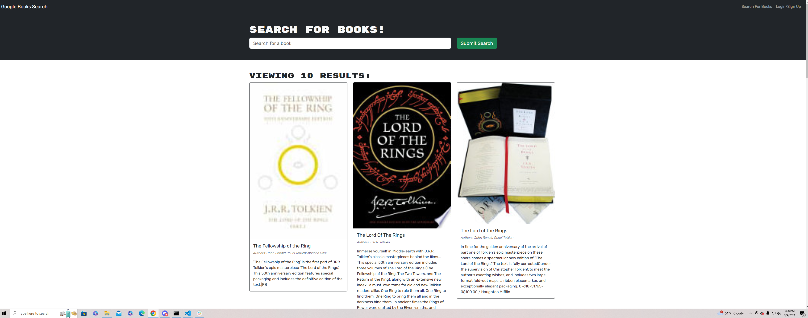

# Book-Search-Engine

Book search engine using the google books API. Updated application with Apollo server with GraphQL queries and mutations

Deployed link: https://book-search-engine-2vty.onrender.com (failed to deploy due to bookSave error)

## Navigation
- [User-Story](#user-story)
- [Description](#description)
- [Author](#author)

## User-Story

AS AN avid reader
I WANT to search for new books to read
SO THAT I can keep a list of books to purchase

## Description

The app was built using the MERN stack with a React front end, MongoDB database, and Node.js/Express.js server and API. It's already set up to allow users to save book searches to the back end. The application has been restructured with an Apollo server to replace the previously existing RESTful API.

## Author

Gregory Quinn Roth - https://github.com/rothgq